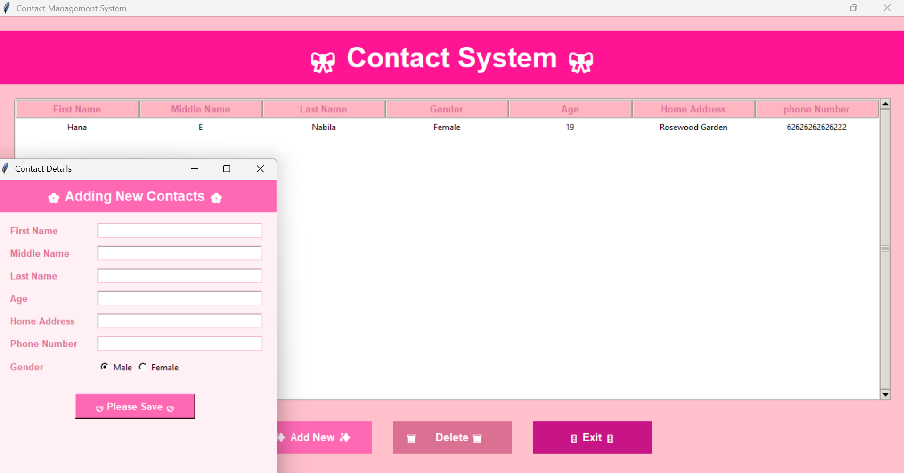

# Contact Management System

A cute pink-themed contact management desktop application built with **Python**, **Tkinter**, and **SQLite**.  
This project focuses on simplicity, usability, and a friendly UI while maintaining functional CRUD operations.

---

## Features
- Add new contacts
- Delete existing contacts
- Persistent data storage using SQLite
- Cute pink user interface
- Desktop-based application

---

## Tech Stack
- Python
- Tkinter (GUI)
- SQLite (Database)

---

## Screenshots

---

